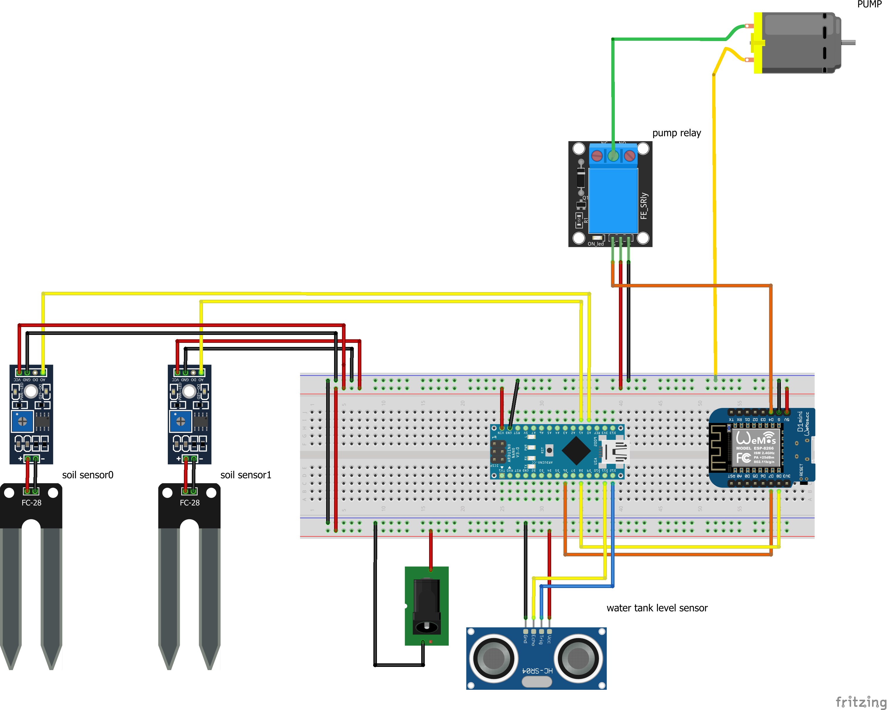

# Watering Control Project

This project is designed to automate watering plants by monitoring the moisture level of the soil and the water level in the tank. It consists of an Arduino Nano that reads analog data from three sensors - two soil moisture sensors and an ultrasonic sensor. The moisture sensors monitor the moisture level of the soil in the plant pots, while the ultrasonic sensor measures the water level in the tank. 

The data collected by the Arduino Nano is sent via serial interface to an ESP8266 module that contains the main logic. The ESP8266 module also controls a water pump via a relay that is connected to its analog port. If the moisture level of the soil is too low, the water pump is activated to water the plants.

All sensor and pump data are transmitted via Wi-Fi and MQTT. The pump can also be manually started via a topic.

## Table of Contents
- [Watering Control Project](#watering-control-project)
  - [Table of Contents](#table-of-contents)
  - [Bill of Materials](#bill-of-materials)
  - [Installation](#installation)
  - [Usage](#usage)
- [Sensor Configuration](#sensor-configuration)
  - [Ultrasonic Sensor](#ultrasonic-sensor)
  - [Soil Moisture Sensor](#soil-moisture-sensor)
  - [Water Tank Level](#water-tank-level)
  - [Soil Moisture Levels](#soil-moisture-levels)
  - [Platformio.ini for Arduino Nano](#platformioini-for-arduino-nano)
  - [Platformio.ini for ESP8266](#platformioini-for-esp8266)
  - [Libraries](#libraries)
  - [Contributors](#contributors)



## Bill of Materials

To build the Watering Control Project, you will need the following components:

- Arduino Nano
- ESP8266 module
- Soil moisture sensors (2x) analog or digital
- Ultrasonic sensor (HC-SR04)
- Relay module 5 volts
- Water pump 5 volts
- Jumper wires
- Breadboard
- Power supply (DC 5V)

It is important to note that the specific models of the components used may vary depending on availability and personal preference.
## Installation

Before using the project, you need to fill in your Wi-Fi and MQTT credentials in the `credentials.hpp.template` file:

```
const char *_wifi_ssid = "";
const char *_wifi_password = "";
const char *_broker_ip = "";
const int _broker_port = 1234;
const char *_broker_user = "";
const char *_broker_password = "";
```

Once you have filled in your credentials, remove the `.template` extension from the file name to use it.

The program is written in C++.

## Usage

To use the Watering Control Project, connect the sensors and relay to the Arduino Nano and upload the code to it. Then, connect the ESP8266 module to the Arduino Nano and start the system. The ESP8266 module will connect to the Wi-Fi network and the MQTT broker, and begin monitoring the soil moisture and water level.

If the moisture level is too low, the pump will automatically turn on and water the plants. The system will also transmit the data to the MQTT broker, which can be viewed on any device that is subscribed to the topic.

# Sensor Configuration
The sensor configuration for the Watering Control Project can be found in the `arduino_nano/lib/sensor` directory.

## Ultrasonic Sensor
The ultrasonic sensor is used to measure the water level in the tank. It is connected to the Arduino Nano via two pins: the Echo pin and the Trigger pin, which are defined as follows:
```
#define ULTRA_SONIC_ECHO_PIN 11    // Echo Pin D11 YELLOW
#define ULTRA_SONIC_TRIGGER_PIN 12 // Trigger Pin D12 BLUE
```
The speed of sound is defined as a constant SOUND_VELOCITY with a value of 0.034.
```
#define SOUND_VELOCITY 0.034
```

## Soil Moisture Sensor
There are two soil moisture sensors that are used to measure the moisture level of the soil in the plant pots. One is connected to the analog pin A0 and the other to digital pin 5.
```
#define MOISTRUE_SENSOR_PIN_ANALOG A0
#define MOISTRUE_SENSOR_PIN_DIGITAL 5
```

The air value and water value are also defined, which are used to calculate the soil moisture level.

```
#define MOISTRUE_SENSOR_AIR_VALUE 1050
#define MOISTRUE_SENSOR_WATER_VALUE 190
```
`You have to calibrate this for you sensors!`


## Water Tank Level
The water tank level is determined by the distance from the sensor to the water level. The minimum and maximum levels are defined as follows:
```
#define WATER_TANK_LEVEL_MIN 20 // distance to bottom of tank
#define WATER_TANK_LEVEL_MAX 2 // distance from water to sensor by filled tank

```
`You have to calibrate this for you water tank!`


## Soil Moisture Levels
There are two possible values for the soil moisture level: SOIL_WET and SOIL_DRY.

```
#define SOIL_WET 0
#define SOIL_DRY 1

```
These values are used to determine when the water pump should be activated.

You can modify these values to fit your specific project requirements.


## Platformio.ini for Arduino Nano
```
[env:nano_every]
platform = atmelmegaavr
board = nano_every
framework = arduino
monitor_speed = 115200
monitor_port = COM9      ; Change this to the correct COM port of your serial monitor
upload_port = COM9       ; Change this to the correct COM port of your Nano
upload_speed = 115200    ; Change this to the desired upload speed
lib_deps = bblanchon/ArduinoJson@^6.19.4 ; 
Add any additional libraries that you require
```

## Platformio.ini for ESP8266
```
[env:nodemcuv2]
platform = espressif8266
board = nodemcuv2
framework = arduino
monitor_speed = 115200
monitor_port = COM7      ; Change this to the correct COM port of your serial monitor
upload_port = COM7       ; Change this to the correct COM port of your ESP8266
upload_speed = 115200    ; Change this to the desired upload speed
lib_deps = 
    knolleary/PubSubClient@^2.8
    arduino-libraries/NTPClient@^3.2.1
    bblanchon/ArduinoJson@^6.19.4 ; Add any additional libraries that you require

```

Ensure that the COM ports for the serial monitor and upload port are set to the correct COM ports for your computer. Also adjust the upload speed to your desired setting. Additionally, you can add any additional libraries that you require to the list of lib_deps.


## Libraries

- [ArduinoJson](https://arduinojson.org/) - This library is used to encode and decode JSON data, which is used to transmit the sensor and pump data via MQTT.

- [PubSubClient](https://github.com/knolleary/pubsubclient) - This library is used to establish a connection to the MQTT broker and publish the sensor and pump data.

- [NTPClient](https://github.com/arduino-libraries/NTPClient) - This library is used to synchronize the time of the ESP8266 module with an NTP server, which is required for accurate timing of the watering process.

All of these libraries are available through the PlatformIO library manager and can be added to the project by specifying the library name and version in the `lib_deps` section of the `platformio.ini` file.


## Contributors

This project was created by Konrad Münch. If you have any questions or suggestions, please feel free to contact me.

